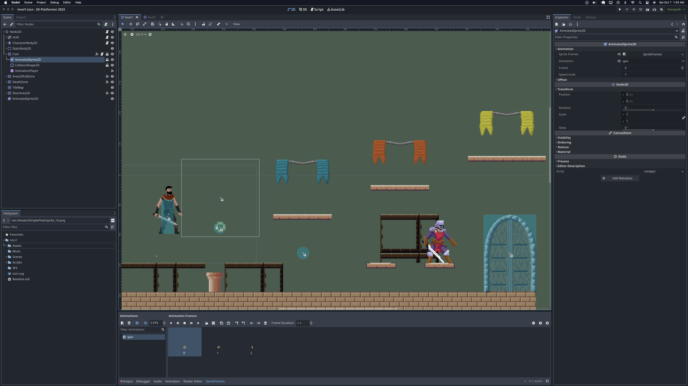
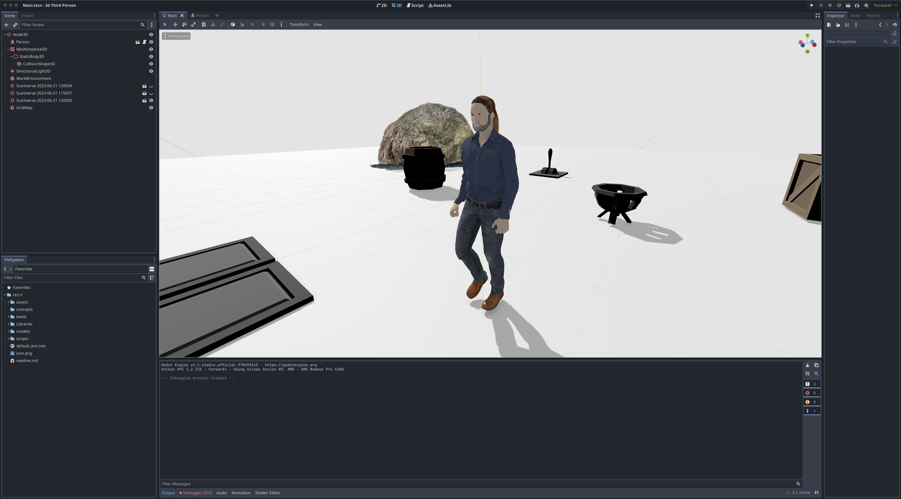

# TD-Godot-4-Demos

A collection of Games made with Godot 4 (coming soon)

This is a sequel of the repo I made [here](https://github.com/TutorialDoctor/TD-Godot-3-Demos) (but better)

Support me on [Patreon](https://www.patreon.com/TutorialDoctor):

Or donate on [Kofi](https://ko-fi.com/thetutorialdoctor)

# 2D Platformer

A customizable 2D platformer

# 3D First Person

A customizable 3D first person controller with model and assets

# 3D Starter  Template

A template project for playing with Godot's 3D functionality

# 3D Model Viewer

A 3D model viewer like I made for Godot 2 & 3

